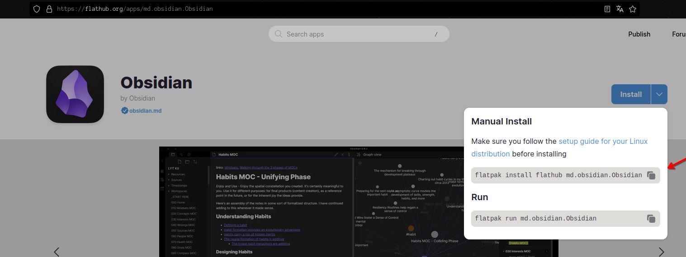

# Flats.sh 
A simple bash script that reads and runs the txt file line per line.
## Dependencies
- [Flatpak](https://flatpak.org/setup/) 
That's it.
## Usage
1. Find the packages you want on [Flathub](https://flathub.org/) 
2. Paste the command from flathub to the txt file.

   
In this case `flatpak install flathub md.obsidian.Obsidian`
 
3. Then run the script as you wish. eg `. flat.sh`